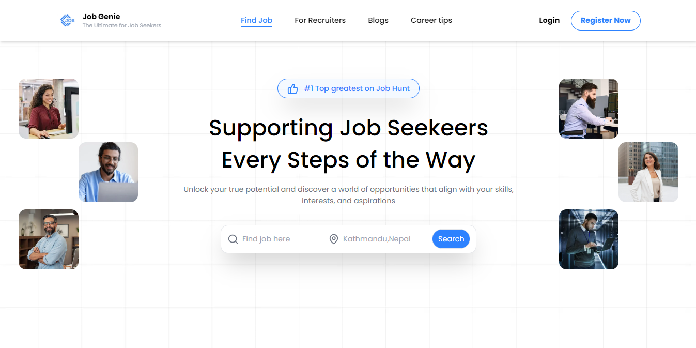
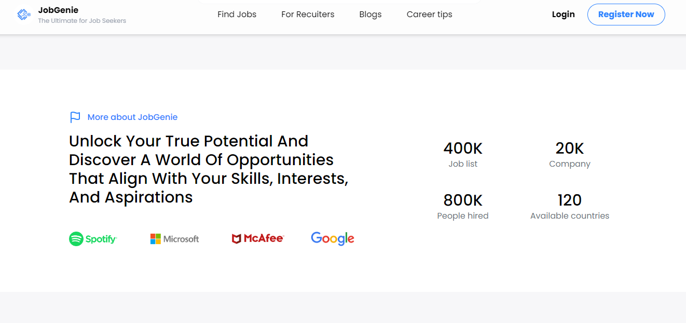
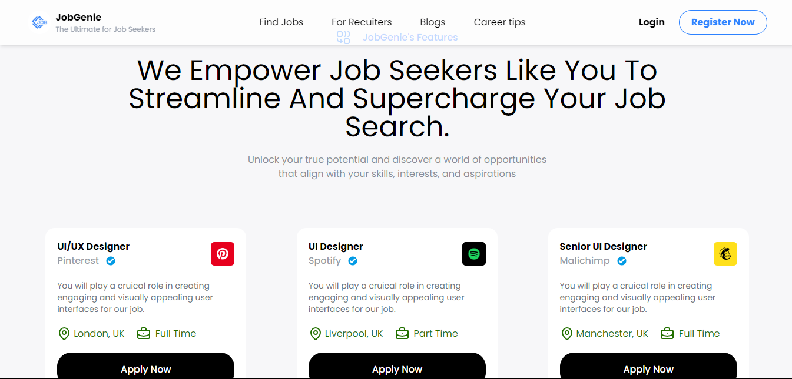
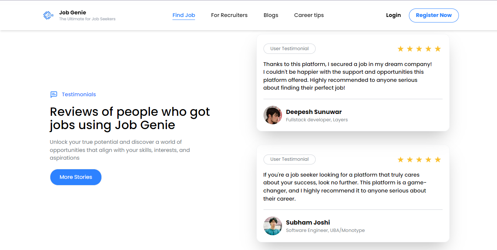
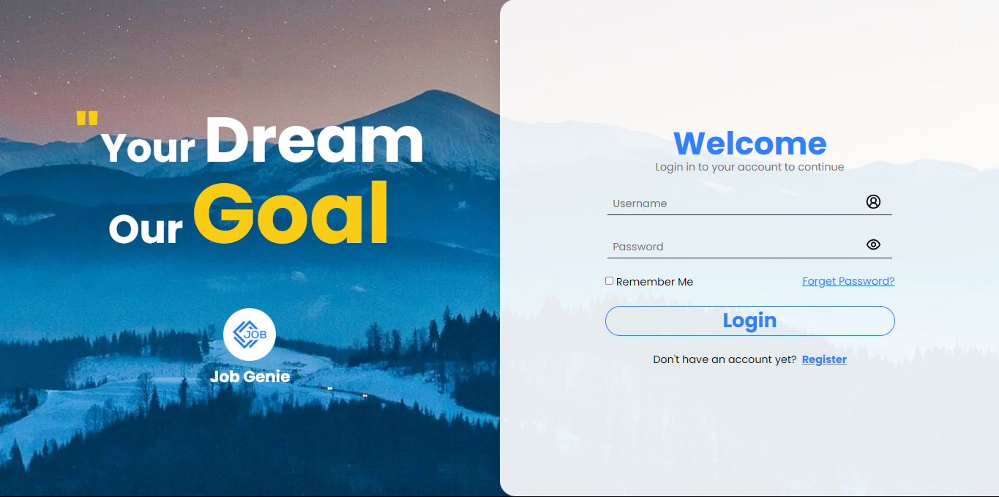

# Job Genie

[JobGenie ](https://jobgenie-website.vercel.app/) is a modern job search platform designed to connect job seekers with top companies across various industries. The homepage features a clean, user-friendly interface, showcasing a curated list of job openings from reputable companies.

## JobGenie previews

## Features of JobGenie:

- 100% Job Guaranteed
- Better Environment
- Good Learning Environment
- 24/7 Tech Support

## Author

[@darkkphoenyx](https://github.com/darkkphoenyx)

## Contact Me

Porfolio: [@darkkphoenyx](https://darkkphoenyx-portfolio.vercel.app/)  
LinkedIn: [@deepeshsunuwar](https://www.linkedin.com/in/deepesh-sunuwar-6237351aa/)  
Facebook: [@deepeshsunuwar](https://www.facebook.com/deepesh.sunuwar.08)  
E-mail: deepgeneral33@gmail.com
